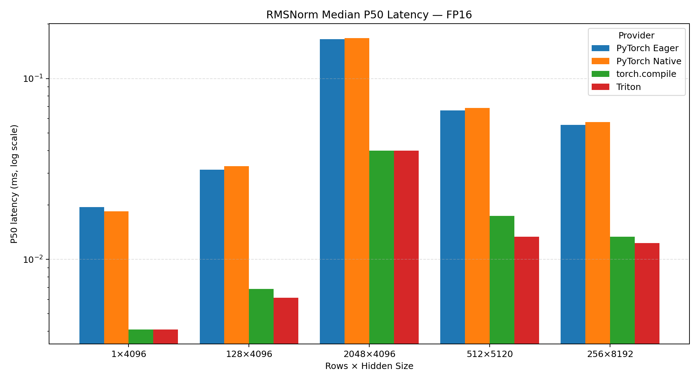
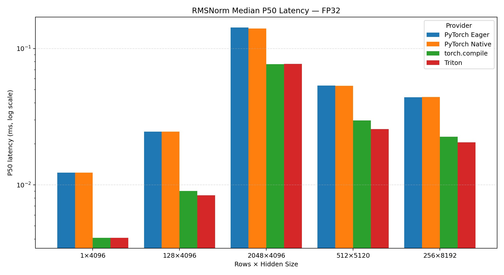
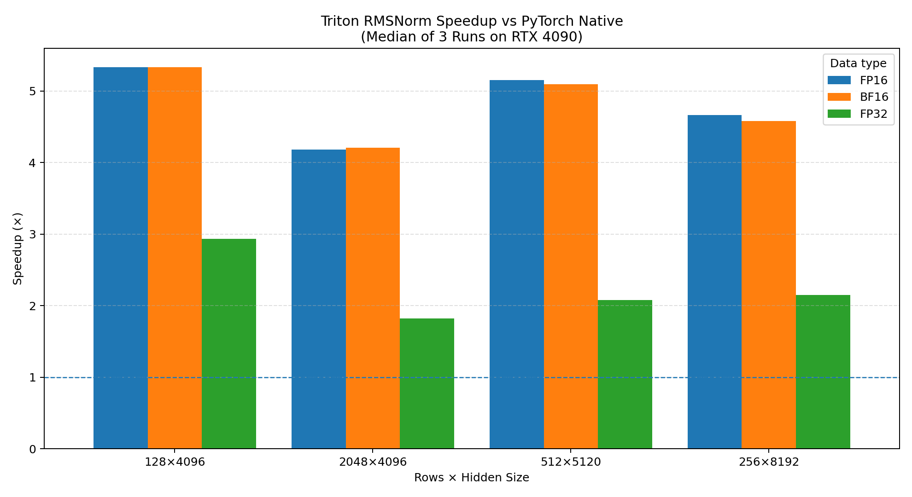
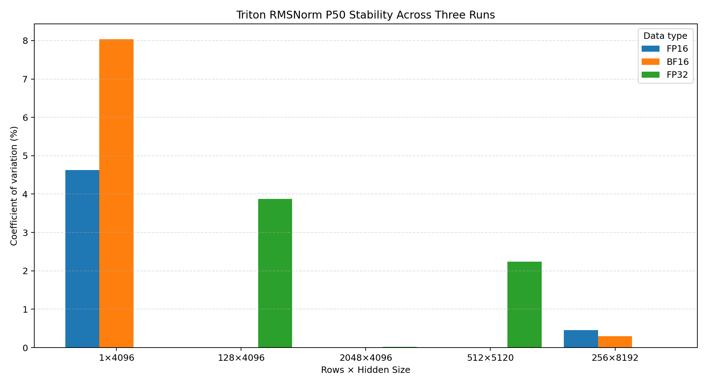

# RMSNorm Benchmark Report

## Environment

- GPU: NVIDIA GeForce RTX 4090
- PyTorch: 2.7.1+cu126
- PyTorch CUDA: 12.6
- Triton: 3.3.1
- Git commit: 4248a03
- Independent runs: 3 per data type
- Measurement: 100 ms warmup, 300 ms repeated benchmark

## Method

The benchmark compares PyTorch Eager, PyTorch Native,
`torch.compile`, and a custom Triton RMSNorm forward kernel.

P50 and P95 values below are the medians of three independent
benchmark runs. Correctness is checked against the FP32-accumulated
PyTorch reference implementation before timing.

## Summary

| Data type   |   Median speedup vs Native |   Best speedup vs Native | Best shape   |   Max Triton P50 CV (%) |
|:------------|---------------------------:|-------------------------:|:-------------|------------------------:|
| FP16        |                     4.9103 |                   5.3333 | 128×4096     |                  0.4522 |
| BF16        |                     4.8397 |                   5.3333 | 128×4096     |                  0.3012 |
| FP32        |                     2.1156 |                   2.9313 | 128×4096     |                  3.8778 |

The one-row `1×4096` case is retained for launch-overhead analysis,
but excluded from the main speedup summary and primary speedup figure.

## Triton Detailed Results

| Dtype   | Shape     |   P50 median (ms) |   P95 median (ms) |   Speedup vs Eager |   Speedup vs Native |   Speedup vs compile |   Effective GB/s |   P50 CV (%) |   Max abs error |
|:--------|:----------|------------------:|------------------:|-------------------:|--------------------:|---------------------:|-----------------:|-------------:|----------------:|
| fp16    | 1×4096    |          0.004096 |          0.004896 |            4.75    |             4.5     |             1        |          6       |     4.63115  |        0        |
| fp16    | 128×4096  |          0.006144 |          0.007168 |            5.10417 |             5.33333 |             1.11458  |        342.667   |     0        |        0.001953 |
| fp16    | 2048×4096 |          0.039936 |          0.041984 |            4.13542 |             4.17949 |             1        |        840.41    |     0        |        0.007812 |
| fp16    | 512×5120  |          0.013312 |          0.014336 |            5       |             5.15385 |             1.30769  |        788.462   |     0        |        0.003906 |
| fp16    | 256×8192  |          0.012288 |          0.013312 |            4.5     |             4.66667 |             1.08333  |        684       |     0.452233 |        0.001953 |
| bf16    | 1×4096    |          0.003776 |          0.004096 |            5.15254 |             4.88983 |             1.08475  |          6.50847 |     8.03187  |        0        |
| bf16    | 128×4096  |          0.006144 |          0.007168 |            5.16667 |             5.33333 |             1.11979  |        342.667   |     0        |        0        |
| bf16    | 2048×4096 |          0.039936 |          0.041984 |            4.14984 |             4.20513 |             1        |        840.41    |     0        |        0.015625 |
| bf16    | 512×5120  |          0.013312 |          0.014336 |            5.0649  |             5.09615 |             1.30769  |        788.462   |     0        |        0.007812 |
| bf16    | 256×8192  |          0.012288 |          0.01308  |            4.56771 |             4.58333 |             1.08333  |        684       |     0.301226 |        0.003906 |
| fp32    | 1×4096    |          0.004096 |          0.00512  |            3       |             3       |             1        |         12       |     0        |        0        |
| fp32    | 128×4096  |          0.008384 |          0.009216 |            2.9313  |             2.9313  |             1.07824  |        502.229   |     3.87778  |        2e-06    |
| fp32    | 2048×4096 |          0.077152 |          0.079872 |            1.84488 |             1.81833 |             0.995438 |        870.039   |     0.023943 |        4e-06    |
| fp32    | 512×5120  |          0.025632 |          0.027648 |            2.08614 |             2.08115 |             1.15855  |        818.976   |     2.24333  |        2e-06    |
| fp32    | 256×8192  |          0.02048  |          0.021504 |            2.14688 |             2.15    |             1.1      |        820.8     |     0        |        2e-06    |

## Figures

### FP16 latency

### BF16 latency

### FP32 latency

### Triton speedup

### Stability

## Notes

- `effective_gbps_median` is a logical effective-bandwidth estimate
  based on minimum input, output, and weight traffic.
- It is not a direct Nsight Compute measurement of physical DRAM traffic.
- FP16 and BF16 reductions use FP32 accumulation.
- Small kernels around several microseconds are influenced strongly
  by launch overhead and timer resolution.
